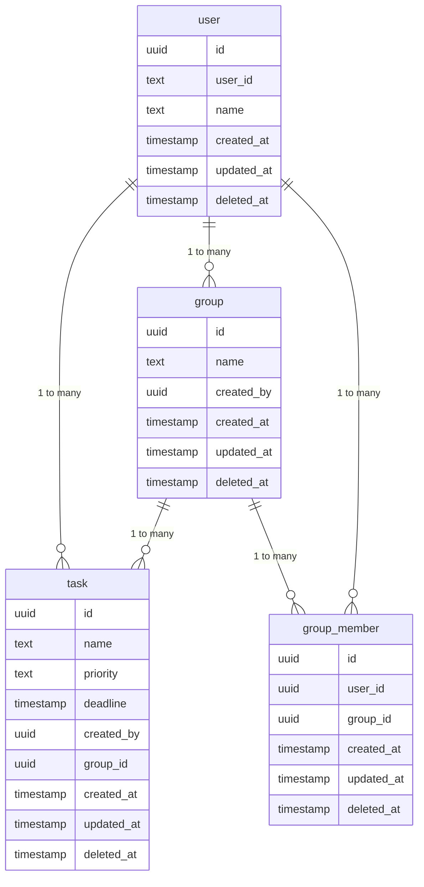

# hasura

## ER 図

```mermaid
erDiagram
    user ||--o{ task : "1 to many"
    user ||--o{ group : "1 to many"
    group ||--o{ task : "1 to many"
    group ||--o{ group_member : "1 to many"
    user ||--o{ group_member : "1 to many"
    user {
        uuid id
        text user_id
        text name
        timestamp created_at
        timestamp updated_at
        timestamp deleted_at
    }
    group {
        uuid id
        text name
        uuid created_by
        timestamp created_at
        timestamp updated_at
        timestamp deleted_at
    }
    task {
        uuid id
        text name
        text priority
        timestamp deadline
        uuid created_by
        uuid group_id
        timestamp created_at
        timestamp updated_at
        timestamp deleted_at
    }
    group_member {
        uuid id
        uuid user_id
        uuid group_id
        timestamp created_at
        timestamp updated_at
        timestamp deleted_at
    }


```
